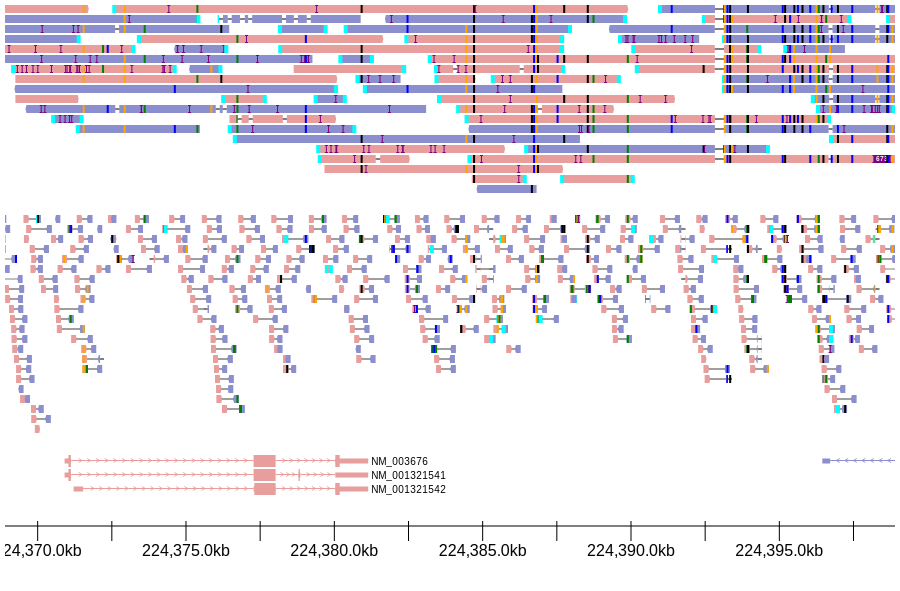

Usage
=====

.. currentmodule:: integrative_transcriptomics_viewer.convenience

This quick tour mirrors the workflow demonstrated in :download:`examples/demo-ITV.ipynb <../examples/demo-ITV.ipynb>` and highlights the steps you will usually perform in a notebook session: configure the reference, render a feature, and persist the result. Each stage links to the API reference so you can drill into detailed keyword descriptions when needed.

Prepare a configuration
-----------------------

The :class:`~integrative_transcriptomics_viewer.convenience.Configuration` object keeps together the reference FASTA, annotations, and reusable plotting tweaks. Construct it once up front and re-use it across plots::

    from integrative_transcriptomics_viewer.convenience import Configuration

    cfg = Configuration(
        genome_fasta="references/hg38.fa",
        bed_annotation={
            "Genes": "annotations/genes.bed.gz",
            "Enhancers": "annotations/enhancers.bed.gz",
        },
        gtf_annotation="annotations/transcripts.gtf",
    )

The BED annotations may be a mapping (names → files) or a list if you do not need custom labels. Providing a GTF file enables name/ID lookups so helper methods such as :meth:`Configuration.plot_feature` can resolve gene synonyms automatically.

Plot a region of interest
-------------------------

With a configuration in hand you can call any of the high-level helpers. A minimal example showing both reads and coverage for a single BAM might look like this::

    bams = {"RNA-seq": "data/sample.bam"}
    doc = cfg.plot_feature(
        feature="ACTB",
        bams_dict=bams,
        padding_perc=0.15,
        with_reads=True,
        with_coverage=True,
        add_track_label="ACTB locus",
    )

Inside a Jupyter notebook the returned document renders automatically when it is the final expression in a cell. If you prefer tabs or exon-level views, dedicated helpers such as :meth:`Configuration.plot_exons` and :meth:`Configuration.plot_by_classification_as_tabs` are available; the same keyword arguments detailed in :meth:`Configuration._build_view_row` control coverage, labels, filtering and colouring.

Export to file
--------------

Plots can be exported to SVG, PNG, or PDF for sharing or publication using :func:`integrative_transcriptomics_viewer.save`::

    from integrative_transcriptomics_viewer import save

    save(doc, "plots/actb.svg")
    save(doc, "plots/actb.png", dpi=300)

The :mod:`integrative_transcriptomics_viewer.export` module also exposes lower-level helpers if you need to embed rendered HTML or integrate into custom dashboards. Refer to :doc:`advanced_usage` for recipes that chain multiple plots together or mix in bespoke tracks.
